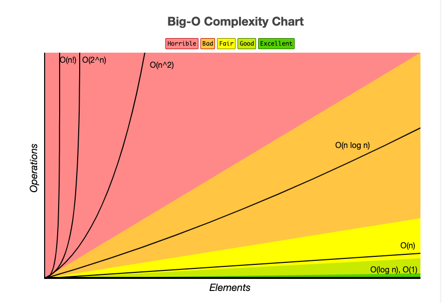
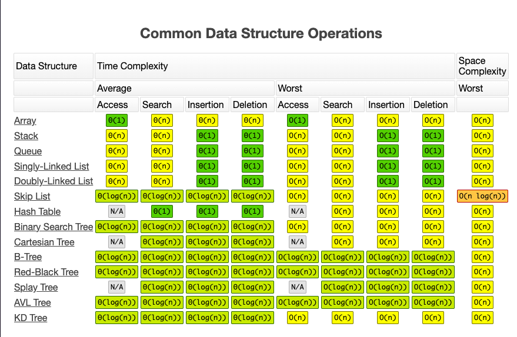
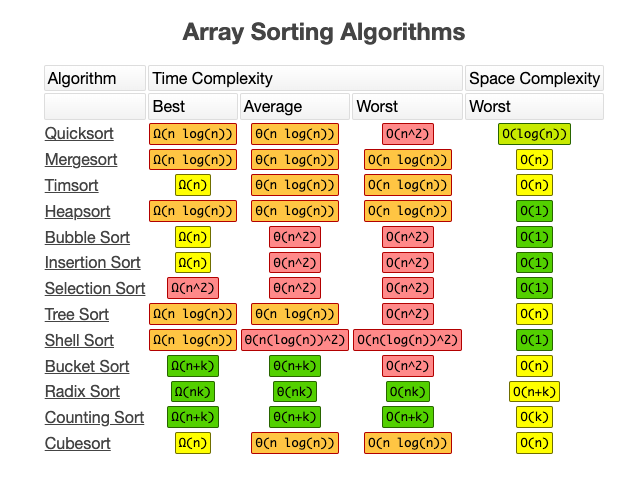

# Learn Data Structure and Algorithm

> try to consistent update everday until **31 March 2024**!!!

learning with implement spec driven evelopment or TDD, all the usecase write in Typescript and Javascript.

## Sorting

- bubble sort
- selection sort
- insertion sort
- merge sort

## Array Search

- linear search
- bubble search

# Hastable

- sample crud hastable

## Fun exerciese

mostly updated after finishing leetcode exercise 😎

- fizzbuzz game
- palindrom
- twosum
- fibonacci

### Reference

- [visualgo](https://visualgo.net/)
- [leetcode](https://leetcodehttps://leetcode.com)
- [tlx.toki](https://tlx.toki.id/)
- [bigfrontend](https://bigfrontend.dev)

## Graph sheet big O notation

source from [bigOCheatSheet](https://www.bigocheatsheet.com/)





To install dependencies:

```bash
bun install
```

To run:

```bash
bun dev
```

to run the testing

```
bun test
```

This project was created using `bun init` in bun v1.0.25. [Bun](https://bun.sh) is a fast all-in-one JavaScript runtime.
